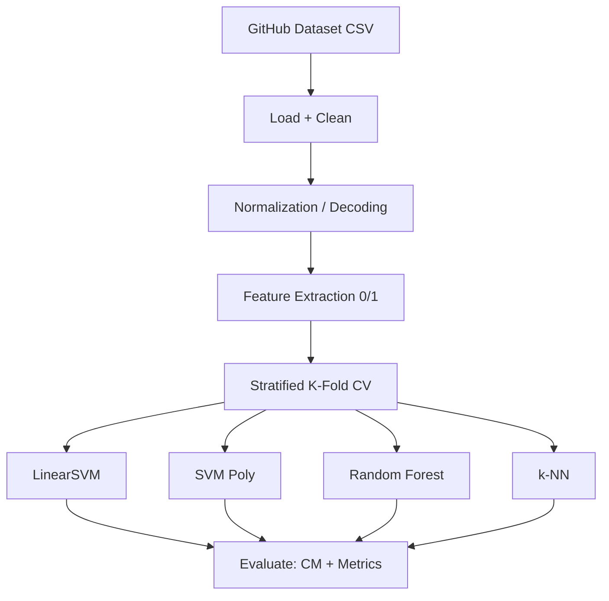
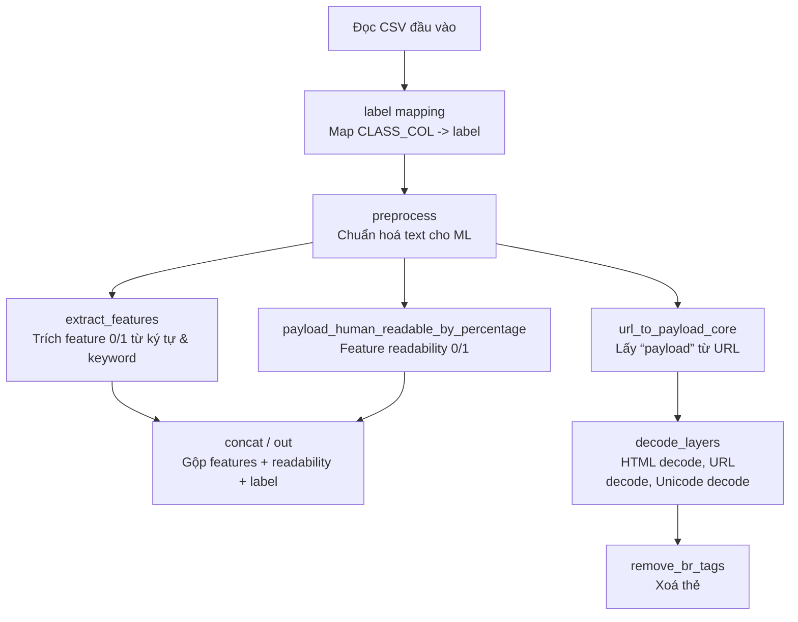

# 🛡️ Detecting Cross-Site Scripting Attacks Using Machine Learning

**Kết quả chính:** ## TODO

---

## 📌 Các bước thực hiện

- ✅ Thu thập dữ liệu và xử lý dữ liệu đầu vào (loại bỏ dữ liệu trùng, dữ liệu rỗng)
- ✅ Extract feature
- ✅ 5 Machine Learning Classifiers (SVM linear, SVM poly, Random Forest, k-NN)
- ✅ Tính toán các chỉ số: Accuracy, Sensitive / Recall, Specificity, Precision, F1

---

## 📂 Cấu trúc thư mục

```
AnToanHocMay/
│
├── extract.ipynb
├── Payloads.csv
├── Payloads_clean.csv
├── features.csv
└── README.md
```

---

## 🛠️ Requirement

```sh
Google Colab
pandas
numpy
sklearn
```

---

## 🗃️ Dataset

### Nguồn dữ liệu

Dataset gốc: **Payloads.csv** từ Github  
[https://github.com/fmereani/Cross-Site-Scripting-XSS](https://github.com/fmereani/Cross-Site-Scripting-XSS)

|          Payloads          |       Class        |
| :------------------------: | :----------------: |
| HTTP URL include parameter | Benign / Malicious |

### Vấn đề dataset gốc

- Payloads nằm tại url path và query parameter
- Missing values, duplicates

### Làm sạch dataset

**Input:** `Payloads.csv` (43,217 samples)

**Xử lý:**

- Loại bỏ missing values
- Xóa duplicates

**Output:** `Payloads_clean.csv` (42,671 samples)

**Phân phối:**

```
Benign (0): 28,068 (65.78%)
Attack (1): 14,603 (34.22%)
```

---

### Tổng quan luồng xử lý



---

## 📊 Phân tích Dataset

| Category      | Detail |
| ------------- | ------ |
| URL has query | 20,065 |
| Invalid URL   | 17     |

---

## 🧠 Logic Normalize

## Workflow



.

---
