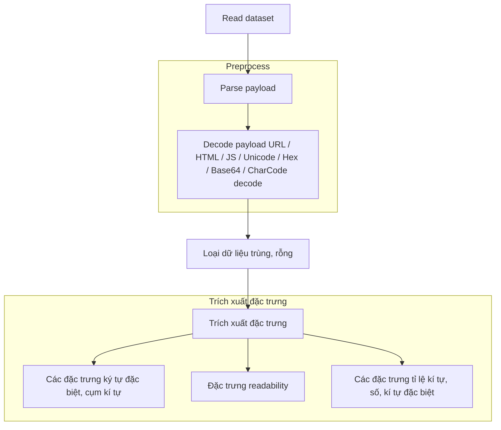
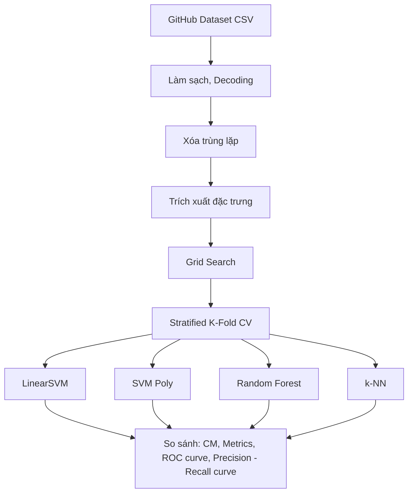

# 🛡️ Detecting Cross-Site Scripting Attacks Using Machine Learning

**Kết quả chính:**

Best performing model: Random Forest (F1 = 0.9891±0.0018)

---

## 📌 Các bước thực hiện

- ✅ Thu thập dữ liệu và xử lý dữ liệu đầu vào (loại bỏ dữ liệu trùng, dữ liệu rỗng)
- ✅ Trích xuất đặc trưng
- ✅ 4 Machine Learning Classifiers (SVM linear, SVM poly, Random Forest, k-NN)
- ✅ Tính toán các chỉ số: Accuracy, Sensitive / Recall, Specificity, Precision, F1

---

## 📂 Cấu trúc thư mục

```
AnToanHocMay/
│
├── extract.ipynb
├── Payloads.csv
├── Payloads_clean.csv
├── features.csv
└── README.md
```

---

## 🛠️ Requirement

```sh
Google Colab
pandas
numpy
sklearn
matplotlib
seaborn
```

---

## 🗃️ Dataset

### Nguồn dữ liệu

Dataset gốc: **Payloads.csv** từ Github  
[https://github.com/fmereani/Cross-Site-Scripting-XSS](https://github.com/fmereani/Cross-Site-Scripting-XSS)

|          Payloads          |       Class        |
| :------------------------: | :----------------: |
| HTTP URL include parameter | Benign / Malicious |

### Vấn đề dataset gốc

- Payloads nằm tại url path và query parameter
- Dữ liệu bị trùng

## 📊 Phân tích Dataset

| Category   | Detail |
| ---------- | ------ |
| Duplicates | 6601   |

---

## 🧹 Làm sạch dataset

**Input:** `Payloads.csv` (43,217 mẫu)

**Xử lý:**

- Decode dữ liệu
- Loại bỏ dữ liệu bị trùng

**Output:** `Payloads_clean.csv` (37,810 mẫu)

**Phân phối:**

```
Benign (0): 28,065 (74.23%)
Attack (1): 9,745 (25.77%)
```

---

## 🧠 Logic Normalize

### Workflow



---

## 🔎 Feature Extraction

Các payload sau khi normalize sẽ được trích xuất thành các đặc trưng số để đưa vào mô hình Machine Learning.

Tổng số đặc trưng: **61**

### Nhóm đặc trưng

#### 1. Ký tự đặc biệt

| Feature            | Description               |
| ------------------ | ------------------------- |
| num_script         | Số lần xuất hiện `script` |
| num_angle_brackets | Số ký tự `<` và `>`       |
| num_quotes         | Số dấu `'` và `"`         |
| num_semicolon      | Số `;`                    |

#### 2. Keyword XSS

| Feature     | Description  |
| ----------- | ------------ |
| has_alert   | có `alert()` |
| has_onerror | có `onerror` |
| has_onload  | có `onload`  |
| has_eval    | có `eval()`  |

#### 3. Character statistics

| Feature       | Description          |
| ------------- | -------------------- |
| length        | độ dài payload       |
| digit_ratio   | tỉ lệ số             |
| special_ratio | tỉ lệ ký tự đặc biệt |

---

## 🤖 Machine Learning Models

Dự án sử dụng 4 thuật toán Machine Learning phổ biến để phân loại payload:

| Model          | Type                  |
| -------------- | --------------------- |
| Linear SVM     | Linear classifier     |
| Polynomial SVM | Non-linear classifier |
| Random Forest  | Ensemble tree         |
| k-NN           | Distance-based        |

### 1️⃣ Linear SVM

Support Vector Machine với kernel tuyến tính.

Ưu điểm:

- Hoạt động tốt với dữ liệu sparse
- Phù hợp với feature vector lớn

---

### 2️⃣ Polynomial SVM

SVM với polynomial kernel.

Giúp phát hiện các quan hệ phi tuyến trong feature space.

---

### 3️⃣ Random Forest

Random Forest là ensemble learning gồm nhiều decision tree.

Ưu điểm:

- Khả năng generalize tốt
- Ít overfitting

---

### 4️⃣ k-Nearest Neighbors (k-NN)

Thuật toán dựa trên khoảng cách giữa các điểm dữ liệu.

Class được quyết định bởi **k điểm gần nhất**.

---

## 📏 Evaluation Metrics

Để so sánh mô hình, sử dụng **Stratified K-Fold Cross Validation (k=5)**. Các chỉ số được sử dụng để so sánh mô hình:

- Accuracy
- Sensitivity / Recall
- Specificity
- Precision
- F1-score

### Lựa chọn hyperparameter

Sử dụng Grid Search để lựa chọn các hyperparemeter của mô hình

### Confusion Matrix

|               | Predicted Benign | Predicted Attack |
| ------------- | ---------------- | ---------------- |
| Actual Benign | TN               | FP               |
| Actual Attack | FN               | TP               |

### Metrics

| Metric               | Formula                                         |
| -------------------- | ----------------------------------------------- |
| Accuracy             | (TP + TN) / Total                               |
| Precision            | TP / (TP + FP)                                  |
| Recall (Sensitivity) | TP / (TP + FN)                                  |
| Specificity          | TN / (TN + FP)                                  |
| F1-score             | 2 _ (Precision _ Recall) / (Precision + Recall) |

---

## 📊 Experiment Results

Model: SVM linear (C=0.1)
| | Predicted Benign | Predicted Attack |
| ------------- | ---------------- | ---------------- |
| Actual Benign | 27728 | 337 |
| Actual Attack | 206 | 9539 |

Model: SVM Poly (deg=3, C=10)
| | Predicted Benign | Predicted Attack |
| ------------- | ---------------- | ---------------- |
| Actual Benign | 27902 | 163 |
| Actual Attack | 100 | 9645 |

Model: KNN (k=5, distance)
| | Predicted Benign | Predicted Attack |
| ------------- | ---------------- | ---------------- |
| Actual Benign | 27960 | 105 |
| Actual Attack | 165 | 9580 |

Model: Random Forest (n=200)
| | Predicted Benign | Predicted Attack |
| ------------- | ---------------- | ---------------- |
| Actual Benign | 27960 | 105 |
| Actual Attack | 107 | 9638 |

| Model         | Accuracy      | Recall        | Specificity   | Precision     | F1            | Time     |
| ------------- | ------------- | ------------- | ------------- | ------------- | ------------- | -------- |
| Linear SVM    | 0.9856±0.0024 | 0.9789±0.0041 | 0.9880±0.0025 | 0.9659±0.0069 | 0.9723±0.0045 | 5.39s    |
| SVM Poly      | 0.9930±0.0012 | 0.9897±0.0030 | 0.9942±0.0009 | 0.9834±0.0027 | 0.9865±0.0023 | 1435.24s |
| Random Forest | 0.9944±0.0009 | 0.9890±0.0021 | 0.9963±0.0010 | 0.9892±0.0028 | 0.9891±0.0018 | 70.49s   |
| k-NN          | 0.9929±0.0010 | 0.9831±0.0028 | 0.9963±0.0006 | 0.9892±0.0019 | 0.9861±0.0020 | 7943.81s |

### 🔄 Tổng quan luồng xử lý



---

## 🧾 Discussion

### Nhận xét

- Random Forest cho kết quả tốt nhất
- SVM Linear có độ ổn định cao
- k-NN nhạy cảm với noise

### Hạn chế

- Dataset không quá lớn
- Feature engineering còn đơn giản
- Payload mới có thể bypass
