# 🛡️ Detecting Cross-Site Scripting Attacks Using Machine Learning

**Kết quả chính:**

#### 🔵 Random Forest ⭐

- Accuracy: 0.9939
- Sensitivity: 0.9913
- Time: 1.31s

---

## 📂 Cấu trúc thư mục

```
AnToanHocMay/
│
├── docs
├── images
├── extract.ipynb
├── Payloads.csv
├── features.csv
└── README.md
```

---

## 🛠️ Requirement

```sh
Google Colab
pandas
numpy
sklearn
matplotlib
seaborn
```

---

## 🗃️ Dataset

### Nguồn dữ liệu

Dataset gốc: **Payloads.csv** từ Github  
[https://github.com/fmereani/Cross-Site-Scripting-XSS](https://github.com/fmereani/Cross-Site-Scripting-XSS)

|          Payloads          |       Class        |
| :------------------------: | :----------------: |
| HTTP URL include parameter | Benign / Malicious |

### Vấn đề dataset gốc

- Payloads nằm tại url path và query parameter
- Dữ liệu bị trùng

## 📊 Phân tích Dataset

| Category               | Detail |
| ---------------------- | ------ |
| Trùng lặp              | 6601   |
| Payload là URL         | 27719  |
| Payload không phải URL | 15498  |
| Payload rỗng           | 1      |
| URL có tham số         | 14974  |
| URL không có tham số   | 12745  |

---

## 🧹 Làm sạch dataset

**Input:** `Payloads.csv` (43,217 mẫu)

**Xử lý:**

- Giải mã dữ liệu
- Loại bỏ dữ liệu bị trùnng

**Output:** 37,810 mẫu đã làm sạch

**Phân phối:**

```
Benign (0): 28,065 (74.23%)
Attack (1): 9,745 (25.77%)
```

---

### 🔄 Tổng quan luồng xử lý

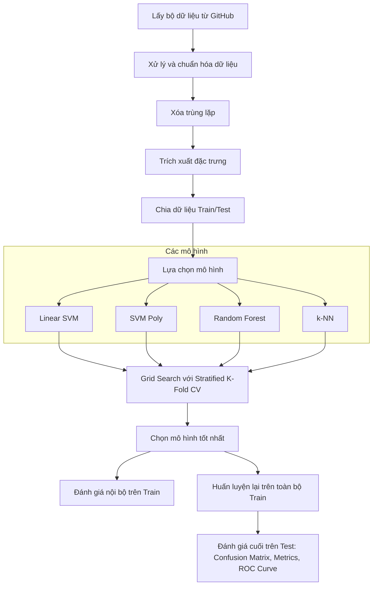

---

## 📦 Pipeline xử lý dữ liệu

### Workflow

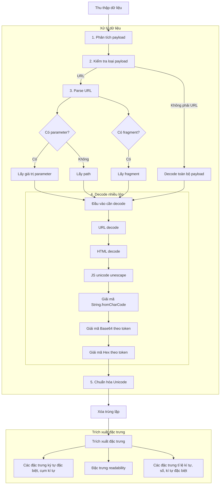

---

## 🔎 Feature Extraction

Các payload sau khi xử lý sẽ được trích xuất thành các đặc trưng số để đưa vào mô hình Machine Learning.

Tổng số đặc trưng: **61**

### Nhóm đặc trưng

#### 1. Ký tự đặc biệt

| Features Group               | Terms                                                                                                       |
| ---------------------------- | ----------------------------------------------------------------------------------------------------------- |
| **Punctuation**              | &, %, /, \, +, ,, ?, !, ;, :, #, =, [, ], $, (, ), ^, \*, ', ", -, <, >, @, \_, ;, {, }, ~, ., space, \|, ¦ |
| **Punctuation Combinations** | ><, ' ", ><, [], ==, &#                                                                                     |

#### 2. Keyword

| Đặc trưng          | Mô tả                                           |
| ------------------ | ----------------------------------------------- |
| **Readability**    | Number of alphabetical characters in the script |
| **Objects**        | document, window, iframe, location, this        |
| **Events**         | onload, onerror                                 |
| **Methods**        | createElement, String.fromCharCode, search      |
| **Tags**           | div, img, `<script>`                            |
| **Attributes**     | src, href, cookie                               |
| **Reserved words** | var                                             |
| **Functions**      | eval()                                          |
| **Protocol**       | http                                            |
| **External file**  | .js                                             |

#### 3. Character statistics

| Đặc trưng     | Mô tả                |
| ------------- | -------------------- |
| letter_ratio  | tỉ lệ chữ cái        |
| digit_ratio   | tỉ lệ số             |
| special_ratio | tỉ lệ ký tự đặc biệt |

---

## 🤖 Machine Learning Models

Dự án sử dụng 4 thuật toán Machine Learning phổ biến để phân loại payload:

| Model          | Type                  |
| -------------- | --------------------- |
| Linear SVM     | Linear classifier     |
| Polynomial SVM | Non-linear classifier |
| Random Forest  | Ensemble tree         |
| k-NN           | Distance-based        |

---

## 📏 Evaluation Metrics

Để so sánh mô hình, sử dụng **Stratified K-Fold Cross Validation (k=5)**. Các chỉ số được sử dụng để so sánh mô hình:

- Accuracy
- Sensitivity / Recall
- Specificity
- Precision
- F1-score
- Thời gian
- CPU / RAM

### Lựa chọn hyperparameter

Sử dụng Grid Search để lựa chọn các hyperparemeter của mô hình

### Confusion Matrix

|               | Predicted Benign | Predicted Attack |
| ------------- | ---------------- | ---------------- |
| Actual Benign | TN               | FP               |
| Actual Attack | FN               | TP               |

### Metrics

| Metric               | Formula           |
| -------------------- | ----------------- |
| Accuracy             | (TP + TN) / Total |
| Precision            | TP / (TP + FP)    |
| Recall (Sensitivity) | TP / (TP + FN)    |
| Specificity          | TN / (TN + FP)    |

---

## 📊 Experiment Results

k-fold = 5

Model: SVM linear (C=1)
| | Predicted Benign | Predicted Attack |
| ------------- | ---------------- | ---------------- |
| Actual Benign | 22,172 | 280 |
| Actual Attack | 169 | 7627 |

Model: SVM Poly (deg=3, C=10)
| | Predicted Benign | Predicted Attack |
| ------------- | ---------------- | ---------------- |
| Actual Benign | 22320 | 132 |
| Actual Attack | 96 | 7700 |

Model: KNN (k=7, distance)
| | Predicted Benign | Predicted Attack |
| ------------- | ---------------- | ---------------- |
| Actual Benign | 22356 | 96 |
| Actual Attack | 151 | 7645 |

Model: Random Forest (n=60, min_samples_split=2, max_depth=20)
| | Predicted Benign | Predicted Attack |
| ------------- | ---------------- | ---------------- |
| Actual Benign | 22364 | 88 |
| Actual Attack | 98 | 7698 |

| Model         | Accuracy | Precision | Sensitivity | Specificity | Time      | AVG Time | CPU     | RAM      |
| ------------- | -------- | --------- | ----------- | ----------- | --------- | -------- | ------- | -------- |
| Linear SVM    | 0.9852   | 0.9646    | 0.9783      | 0.9875      | 16.7847s  | 0.84s    | 119.3%  | 347.7MB  |
| SVM Poly      | 0.9925   | 0.9831    | 0.9877      | 0.9941      | 723.1784s | 9.03s    | 138.60% | 535.18MB |
| Random Forest | 0.9939   | 0.9887    | 0.9874      | 0.9961      | 394.5386s | 2.92s    | 231%    | 602.23MB |
| k-NN          | 0.9918   | 0.9876    | 0.9806      | 0.9957      | 43.8207s  | 1.46s    | 119.1%  | 535.68MB |

### Kết quả đánh giá với tập test

| Model         | Accuracy | Precision | Sensitivity | Specificity | Time    | CPU    | RAM       |
| ------------- | -------- | --------- | ----------- | ----------- | ------- | ------ | --------- |
| Linear SVM    | 0.9874   | 0.9783    | 0.9728      | 0.9925      | 0.7297s | 118%   | 455.004MB |
| SVM Poly      | 0.9943   | 0.9852    | 0.9828      | 0.9948      | 1.86s   | 138.3% | 477.012MB |
| Random Forest | 0.9939   | 0.9852    | 0.9913      | 0.9948      | 1.3154s | 119%   | 396.66MB  |
| k-NN          | 0.9925   | 0.9876    | 0.9831      | 0.9957      | 1.4681s | 118.9% | 405.17MB  |

### Kết quả đánh giá với bộ test riêng biệt

| Model         | Accuracy | Sensitivity | Execution Time (sec) | RAM Peak (MB) | CPU Peak (%) |
| ------------- | -------- | ----------- | -------------------- | ------------- | ------------ |
| Random Forest | 0.9400   | 0.9400      | 1.2659               | 458.9453      | 119.0        |
| SVM Linear    | 0.9185   | 0.9185      | 0.5067               | 458.9453      | 99.4         |
| KNN           | 0.9161   | 0.9161      | 0.2027               | 458.9453      | 118.9        |
| SVM Poly      | 0.8309   | 0.8309      | 2.3346               | 458.9453      | 115.3        |

### Feature Importance & ROC

ROC Curve thể hiện khả năng phân biệt giữa các mẫu tấn công XSS và mẫu bình thường của mô hình. Trục X biểu diễn tỷ lệ false positive, trong khi trục Y biểu diễn tỷ lệ true positive. Đường cong càng gần góc trên bên trái thì mô hình càng tốt.

Random Guess là đường baseline trong ROC Curve, thể hiện một mô hình đoán hoàn toàn ngẫu nhiên. Đường này có AUC bằng 0.5 và được dùng làm mốc để so sánh hiệu năng của các mô hình học máy.

Trong kết quả thực nghiệm, tất cả các mô hình đều đạt AUC tốt, cho thấy khả năng phân loại rất tốt. Trong đó Random Forest đạt AUC cao nhất (0.9995), chứng tỏ đây là mô hình có khả năng phân biệt tốt nhất giữa XSS và normal.

<p align="center">
  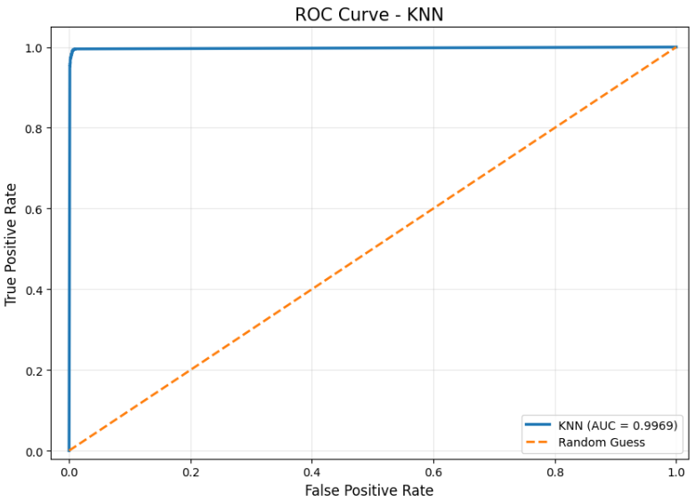
  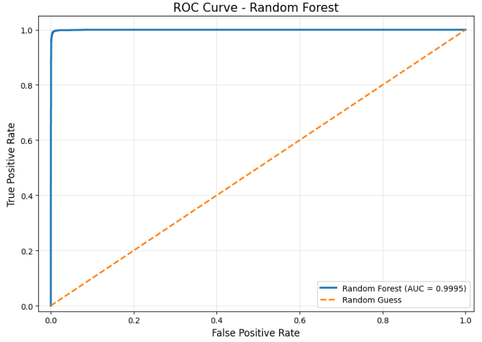
</p>
<p align="center">
  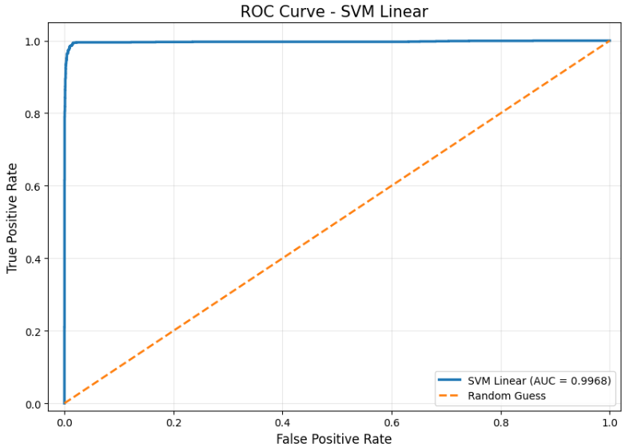
  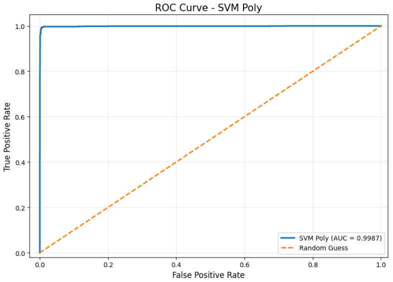
</p>

| Model             | Phân bố Feature Importance  | Phụ thuộc 1 feature | Rủi ro                        |
| ----------------- | --------------------------- | ------------------- | ----------------------------- |
| **KNN**           | Không đều (top 2 vượt trội) | ⚠️ Trung bình       | Dễ bias theo pattern đơn giản |
| **SVM Linear**    | Rất đều                     | ❌ Không            | Thấp                          |
| **SVM Poly**      | Rất lệch                    | 🔴 Có (rõ rệt)      | ⚠️ Overfitting                |
| **Random Forest** | Khá đều                     | ❌ Không            | Thấp                          |

<p align="center">
  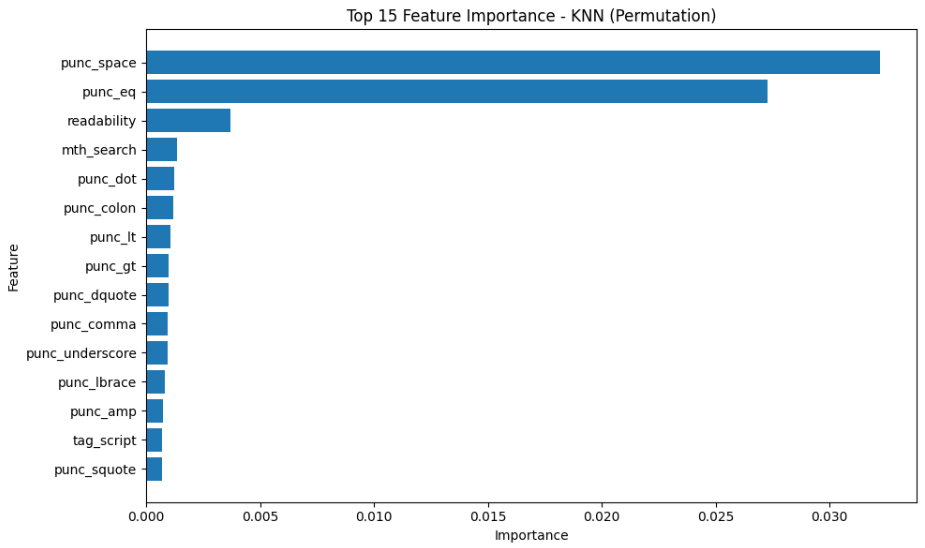
  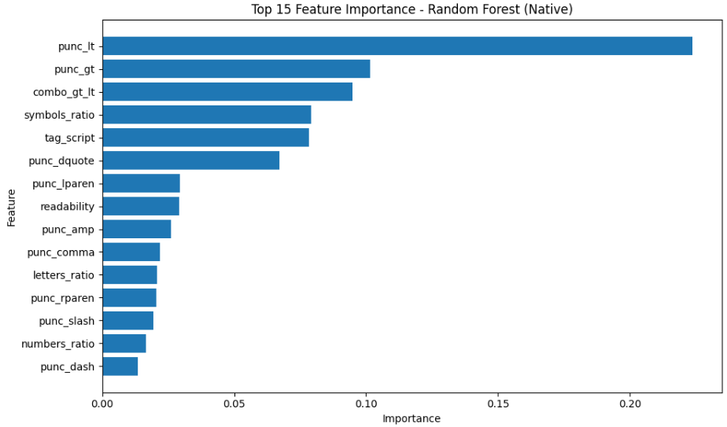
</p>

<p align="center">
  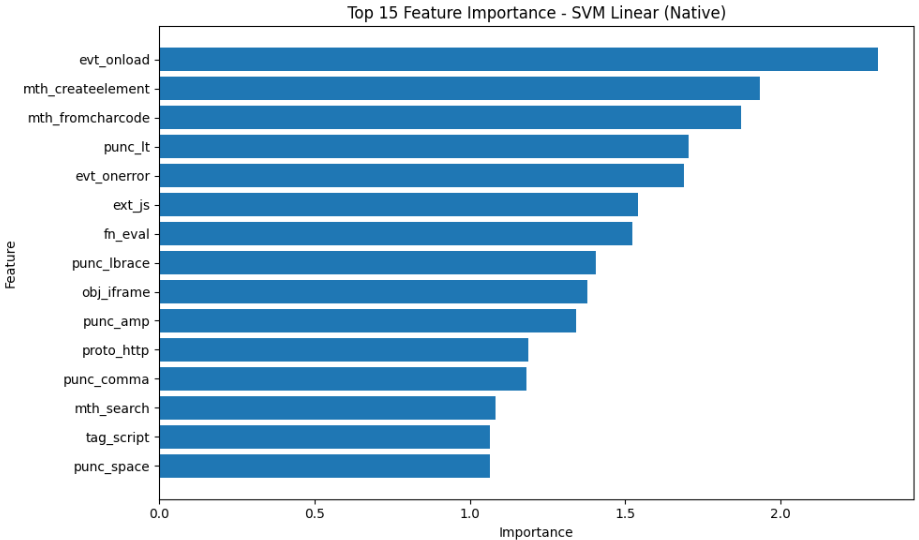
  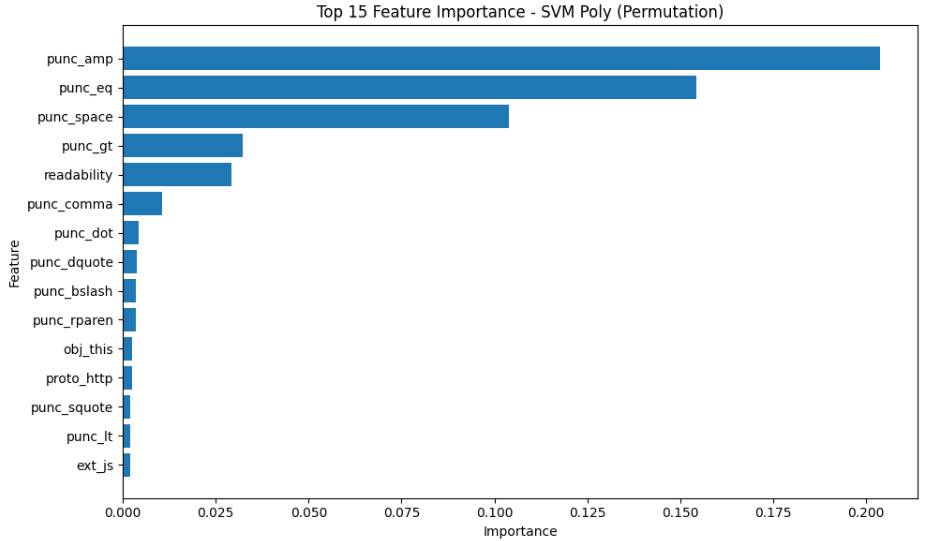
</p>

## 🎯 Tiêu chí đánh giá

### Độ ưu tiên

1. Sensitivity (Recall)
2. Precision
3. Accuracy
4. Specificity
5. Efficiency

### 📊 Phân tích từng model

#### 🔵 1. Linear SVM

- Accuracy: 0.9874 (thấp nhất)
- Sensitivity: 0.9728 (thấp nhất)
- Time: nhanh nhất (0.73s)

#### 🟣 2. SVM Poly

- Accuracy: cao nhất (0.9943)
- Precision: cao
- Time: 1.86s (chậm hơn RF)

#### 🔵 Random Forest

- Accuracy: 0.9939 (gần cao nhất)
- Sensitivity: 0.9913 (rất cao)
- Time: 1.31s (nhanh hơn SVM Poly)
- RAM: thấp nhất

#### 🔴 K-NN

- Sensitivity: 0.9831 (cao)
- Precision: cao
- Time: 1.47s

## 🏆 Bảng đánh giá tổng hợp

| Model                | Accuracy      | Sensitivity (Recall) | Precision | Time                      | Resource (RAM/CPU) | Feature Distribution | Overfitting Risk |
| -------------------- | ------------- | -------------------- | --------- | ------------------------- | ------------------ | -------------------- | ---------------- |
| **Linear SVM**       | 0.9874 ❌     | 0.9728 ❌            | 0.9783 ❌ | ⭐ **Nhanh nhất (0.73s)** | Trung bình         | ✔ Rất đều            | ❌ Thấp          |
| **SVM Poly**         | ⭐ **0.9943** | 0.9828               | ⭐ 0.9852 | 1.86s                     | Cao                | ❌ Rất lệch          | 🔴 Cao           |
| **Random Forest** ⭐ | 0.9939        | ⭐ **0.9913**        | ⭐ 0.9852 | ⭐ 1.31s                  | ⭐ RAM thấp nhất   | ✔ Cân bằng           | ❌ Thấp          |
| **k-NN**             | 0.9925        | ⭐ **0.9831**        | ⭐ 0.9876 | ❌ 1.46s                  | Cao                | ⚠️ Lệch nhẹ          | ❌ Thấp          |

## 📉 Kết quả so sánh khi kiểm tra với bộ dataset riêng

| Model             | Accuracy giảm (%) | Sensitivity giảm (%) |
| ----------------- | ----------------- | -------------------- |
| **Linear SVM**    | **6.98%**         | **5.58%**            |
| **SVM Poly**      | **16.43%** 🔴     | **15.46%** 🔴        |
| **Random Forest** | **5.43%** ⭐      | **5.18%** ⭐         |
| **k-NN**          | **7.70%**         | **6.81%**            |

<p align="center">
  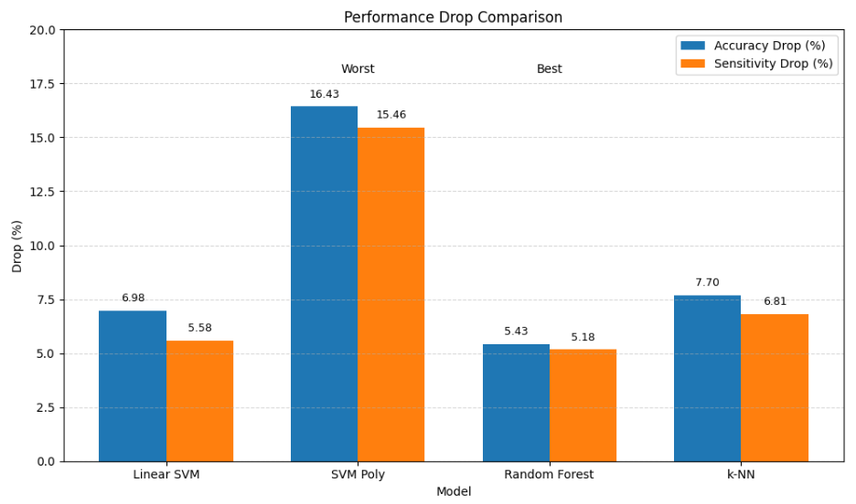
</p>
